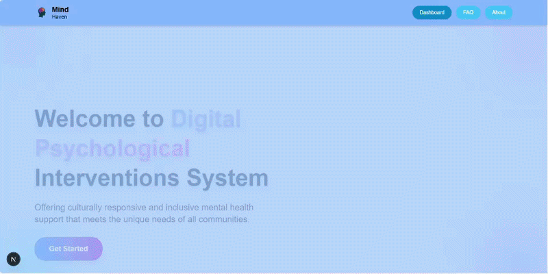
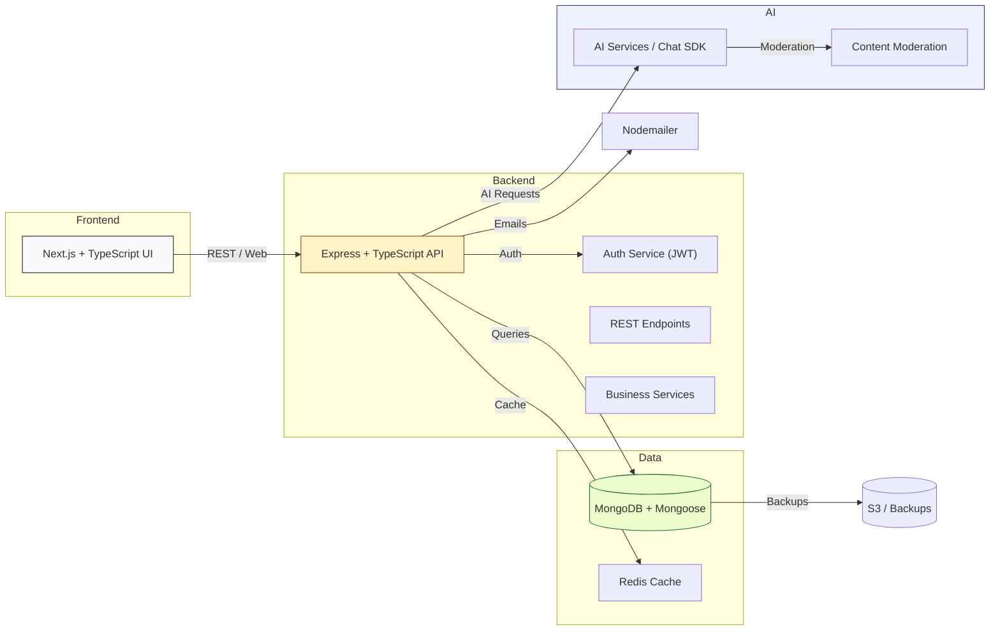

# 🧠 MindHaven — AI Powered Digital Psychological Intervention System

[](https://github.com/animesh6532/MindHaven/actions)
[](https://github.com/animesh6532/MindHaven/blob/main/LICENSE)
[](https://github.com/animesh6532/MindHaven)
[](https://github.com/animesh6532/MindHaven/stargazers)
[](https://github.com/animesh6532/MindHaven/network/members)
[](https://github.com/animesh6532/MindHaven/issues)
[](https://github.com/animesh6532/MindHaven/pulls)

🚀 **MindHaven** is an AI-powered Digital Psychological Intervention System designed to provide **mental health support, AI-assisted counseling, emotional wellness tracking, screening assessments, emergency assistance, and healthcare accessibility** through an intelligent and scalable platform.

---


## 🎬 Demo
GIF / Video placeholder (replace with actual demo)


---

## ❗ Problem Statement
Access to timely, affordable, and private mental health support is limited for many. Fragmented tools, long wait times for care, and stigma prevent early help-seeking. Recruiters and stakeholders want projects demonstrating product thinking, AI safety, and real-world impact.

---

## ✅ Solution Provided
MindHaven combines an intuitive Next.js frontend with a robust Express + MongoDB backend and AI services to provide:
- Real-time conversational AI assistant for emotional support
- Screening tools for common mental health conditions
- Emergency triage resources and rapid help flows
- Peer support and booking workflows
- Analytics dashboard for outcomes and usage insights
- Secure, scalable architecture built for production readiness


---

## ✨ Key Features
- AI Mental Health Assistant (context-aware, privacy-first)
- Secure user authentication & role-based authorization
- Mental health screening workflows (validated questionnaires)
- Dashboard analytics & reporting
- Emergency support module with triage flows
- Peer support system with moderated interactions
- Appointment booking & calendar integration
- Personalized resource recommendations
- Responsive UI with accessibility considerations
- Email notifications (Nodemailer) & transactional flows

---

## 🧭 Architecture Diagram


---

## 🛠️ Tech Stack
| Layer | Technology |
|---|---|
| Frontend | Next.js, TypeScript, TailwindCSS, Radix UI, AI SDK, Axios |
| Backend | Node.js, Express, TypeScript, MongoDB, Mongoose, JWT, Zod |
| Dev / Testing | ESLint, Prettier, Supertest, Jest |
| Infra / Ops | Docker (optional), Redis, Nginx, CI/CD (GitHub Actions) |
| Notifications | Nodemailer (Email), Twilio (SMS - optional) |

---

## 📁 Folder Structure
```
frontend/
  src/
    app/
    components/
    services/
    styles/
  package.json
backend/
  src/
    config/
    middlewares/
    modules/
      ai-chat/
      analytics/
      auth/
      booking/
      peer-support/
      resources/
      screening/
    tests/
  package.json
```

(Full repo structure mirrored in project root — preserve TypeScript/JS dual files for build targets)

---

## ⚙️ Installation Guide

Prerequisites:
- Node.js 18+ and npm/yarn/pnpm
- MongoDB (local or Atlas)
- Redis (optional, recommended for caching)
- Git

Clone:
```bash
git clone https://github.com/yourusername/MindHaven.git
cd MindHaven
```

Install dependencies:

Backend
```bash
cd backend
npm install
```

Frontend
```bash
cd frontend
npm install
```

---

## 🔐 Environment Variables

Backend (.env)
| Variable | Required | Description |
|---|---:|---|
| `PORT` | ✅ | Backend server port |
| `MONGO_URI` | ✅ | MongoDB connection string |
| `JWT_SECRET` | ✅ | JWT signing secret |
| `JWT_EXPIRES_IN` | ✅ | Token expiry (e.g., 7d) |
| `EMAIL_HOST` | ❗ | SMTP host (for Nodemailer) |
| `EMAIL_USER` | ❗ | SMTP user |
| `EMAIL_PASS` | ❗ | SMTP password |
| `AI_API_KEY` | ✅ | Key for AI provider / SDK |
| `REDIS_URL` | ❗ | Optional Redis URL |
| `NODE_ENV` | ✅ | environment (development|production) |

Frontend (.env.local)
| Variable | Required | Description |
|---|---:---|---|
| `NEXT_PUBLIC_API_BASE` | ✅ | e.g., `https://api.example.com` |
| `NEXT_PUBLIC_AI_KEY` | ❗ | Optional public AI key if needed |

Note: Keep all secrets out of repos — use CI/CD secrets or Vault.

---

## ▶️ Running Locally

Start Backend (dev)
```bash
cd backend
npm run dev
# or: npm run dev:ts (if using ts-node/ts-node-dev)
```

Start Frontend (dev)
```bash
cd frontend
npm run dev
# opens at http://localhost:3000 by default
```

Run tests (backend)
```bash
cd backend
npm test
# or: npm run test:watch
```

---

## 📡 API Endpoints Summary

| Method | Route | Auth | Purpose |
|---|---|---:|---|
| POST | /api/auth/register | No | Register a new user |
| POST | /api/auth/login | No | Login / Token issue |
| GET | /api/auth/me | Yes | Get current user profile |
| POST | /api/ai-chat/message | Yes | Send message to AI assistant |
| POST | /api/screening/submit | Yes | Submit screening responses |
| GET | /api/analytics/summary | Yes (admin) | Dashboard analytics |
| POST | /api/booking/create | Yes | Create appointment / booking |
| POST | /api/peer-support/post | Yes | Post to peer support feed |
| POST | /api/emergency/triage | No | Emergency help flow / resources |
| GET | /api/resources | No | Get recommended resources |
| PUT | /api/profile | Yes | Update user profile |

Tip: For complete API docs, integrate Swagger/OpenAPI (recommended).

---

## 🖼️ Screenshots
Replace these placeholders with actual UI screenshots or Figma embeds.

- Landing / Home: `docs/screenshots/home.png`
- Chat Assistant: `docs/screenshots/chat.png`
- Screening Flow: `docs/screenshots/screening.png`
- Dashboard Analytics: `docs/screenshots/dashboard.png`
- Booking Flow: `docs/screenshots/booking.png`

---

## 🔒 Security Features
- JWT-based authentication with role scoping
- Input validation using Zod — strong runtime checks
- Rate limiting + IP throttling on sensitive endpoints
- Content moderation & AI safety layer for user-generated text
- HTTPS enforcement and secure cookie flags in production
- Proper password hashing (bcrypt) and token rotation strategies
- Environment-based secrets (no secrets in repo)
- Email verification flows, account lockouts, and audit logs (extendable)

---

## 📈 Scalability & Production Notes
- Stateless API design supports horizontal scaling behind a load balancer (Nginx / ALB)
- Use Redis for caching session lookups, rate limits, and AI response caching
- MongoDB: shard or scale read replicas for traffic spikes; add indices on query-heavy fields
- CI/CD pipelines for automated tests, linting, and rollouts (GitHub Actions)
- Containerize services with Docker for reproducible deployments
- Queue long-running tasks (emails, analytics aggregation) using BullMQ / RabbitMQ
- Monitor with Prometheus + Grafana and centralize logs (ELK / Loki)

---

## 🔮 Future Enhancements
- Federated / end-to-end encrypted conversations for extra privacy
- Add voice / multimodal assistant (speech-to-text + TTS)
- Integrated clinician dashboard with case management
- SSO / OAuth2 integrations for organizational deployments
- On-device or private-instance LLM options for HIPAA-like compliance
- Native mobile apps with offline-first support
- Auto-scaling and infrastructure IaC with Terraform

---

## ⚔️ Challenges Faced
- Balancing AI usefulness with safety and moderation
- Designing screening flows that are clinically informed yet user-friendly
- Ensuring privacy while retaining analytics usefulness
- Architecting for both MVP speed and future scalability

---

## 🎓 Learning Outcomes
- Production-grade fullstack TypeScript application patterns
- Integrating AI SDKs safely (rate limits, content moderation)
- Designing endpoint contracts and validation with Zod
- Practical experience with authentication, testing, and email systems
- Building UX for sensitive domains (mental health)

---

## 🤝 Contribution Guide
- Fork the repo and create a feature branch: `feature/<topic>`
- Run tests and linters locally
- Open a pull request with a clear description and screenshots
- Follow conventional commits and include unit tests for new logic
- See [CONTRIBUTING.md](CONTRIBUTING.md) for details and code of conduct

---

## 📜 License
This project is released under the MIT License. See [LICENSE](LICENSE) for details.

---

## 📬 Contact
- Maintainer: Your Name — replace with your details  
- Email: your.email@example.com  
- GitHub: https://github.com/yourusername  
- LinkedIn: https://linkedin.com/in/yourprofile

---

## 💡 Why This Project Matters (for Recruiters)
- Demonstrates product sense: end-to-end feature set from screening to escalation.
- Shows fullstack competence with TypeScript across frontend & backend.
- Highlights responsible AI engineering (safety + moderation).
- Evidence of building privacy and scalability into design — valuable for healthcare-focused roles.
- Ready-to-demo UI + dashboard — makes interviews interactive and memorable.

---

## 🏆 Achievement / Resume Bullets
- Designed and implemented MindHaven, an AI-driven mental health platform using Next.js + Node.js, reducing manual triage time and improving user engagement.
- Built a role-based JWT authentication system with secure token management and email verification.
- Implemented screening flows and analytics pipelines, enabling data-driven insights for product improvements.
- Integrated AI assistant with moderation layer and response caching for safe, low-latency interactions.
- Wrote end-to-end tests using Supertest & Jest and established CI pipelines for automated checks.

---

## ✍️ Additional Copy (Ready-to-use)

**Resume — Short (1 line)**  
Built MindHaven, a scalable AI-driven mental health web platform (Next.js, Node.js, MongoDB) delivering screening, AI counseling, emergency triage, and analytics.

**Resume — Medium (2-3 lines)**  
Led development of MindHaven, an AI-powered mental health intervention system using Next.js and Express with MongoDB. Implemented secure JWT authentication, screening flows, an AI counseling assistant, and dashboard analytics; integrated email notifications and end-to-end validation with Zod.

**Resume — Long (1 paragraph)**  
Spearheaded the full-stack development of MindHaven — an AI-powered digital psychological intervention platform. Architected a Next.js frontend and Express + TypeScript backend with MongoDB, integrating an AI assistant for empathetic support, validated screening workflows, peer-support modules, and an analytics dashboard. Focused on secure JWT authentication, Zod-driven validation, content moderation, and production-ready patterns including caching, CI, and comprehensive testing.

**LinkedIn Project Description**  
MindHaven is an AI-assisted mental health platform (Next.js, TypeScript, Node.js, MongoDB) offering conversational support, clinical screening, emergency triage, peer support, and appointment booking. Built with privacy-first design, moderation safeguards, and scalable architecture — ideal for demoing product and engineering skills.

**GitHub Repo Short Description**  
AI-powered mental health platform: empathetic chat, screening, emergency triage, booking, and analytics.

**Portfolio Description**  
MindHaven is a thoughtfully designed AI mental health web app combining conversational AI support with clinical screening and emergency workflows. The project showcases fullstack TypeScript engineering (Next.js + Express), secure authentication, AI safety layers, and a responsive UI — perfect for demonstrating product thinking, engineering rigor, and ethical AI considerations.

---

## 📌 Final Notes & Next Steps
- Replace placeholders (demo GIF, screenshots, `yourusername`, email, LinkedIn) with live assets and links.  
- Add OpenAPI / Swagger docs for full endpoint coverage.  
- Consider a short recorded walkthrough video (2–3 minutes) for recruiter demos.

If you'd like, I can:
- generate optimized repository badges (CI, coverage) and add a `CONTRIBUTING.md`,
- create a demo GIF from a short walkthrough,
- produce an OpenAPI spec for the backend.

---

_Generated and added to project by GitHub Copilot assistant._
